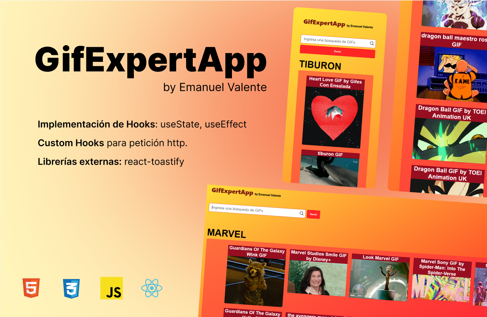

# Gif Expert App

This is a Gif finder coded with React JS.
I used State Hooks, Custom Hook for http request, CSS vanilla for styles and react-toasted-library for the toast.
I hava also used Figma for the presentation on picture.

enjoy it!


<br>
<br>

## You can clone this repo with:

```
git clone (url)
```

## Install Vite dependencies

```
npm install
```

## Run the dev server

```
npm run dev
```
